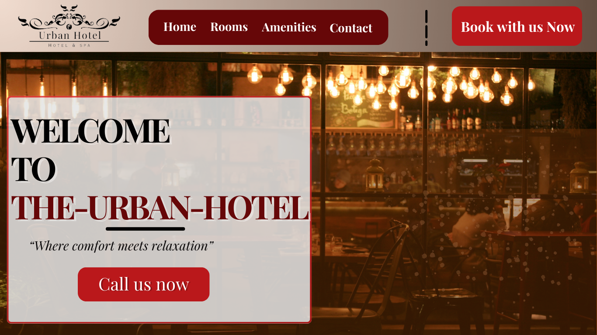
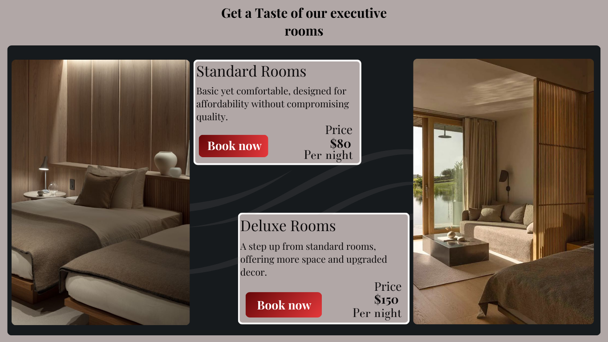
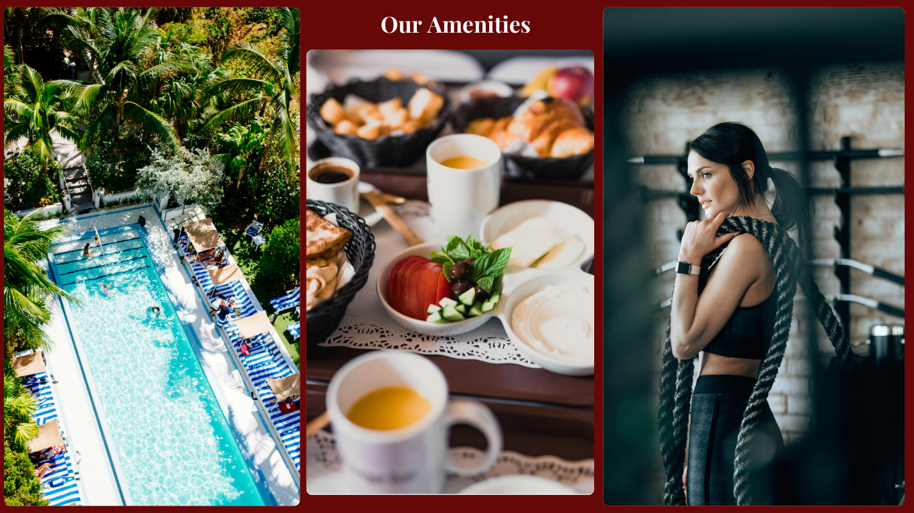

# Hotel-Website-Project
## Overview
This is a modern hotel website showcasing what  the hotel offers using HTML, CSS.
it will mainly show its great amenities and it's services. 
## Table of Contents.
- About the project
- Features
- Getting Started
- Design Mockups
- Contributing
- License
- Contact
## About the Project
This is a responsive Hotel website Design, where guests can discover and book a hotel’s accommodations and services.

- **Hotel Name:** *Urban-hotel*

- **Color Theme** *The website will go for a modern, elegant design using the following colors*

> **Color Themes:**

White (#FFFFFF)

Light red (#E5383B)

Dark Gray (#161A1D)

Dark red (#660708)

Brushed Gold (#D4AF37)

> **Fonts used.**

**Primary Fonts: (Headlines)**

- (Serif) Playfair Display.

- (Serif) Bodoni Moda

**Secondary Fonts: (Body Text)**

- (Sans-Serif) Roboto.

- (Sans-Serif) Open Sans

### Images, Videos, icons and other assets will be accessed in the following site.

## Features
1. Rooms and Suites Page

2. Amenities and Facilities

3. Dining and Restaurant Information

4. Location and Contact

5. Gallery

## Getting started
*The project will replicate that of a hotel where the user, will be able to see where the hotel is located, when the hotel started, how the hotel operates, and also see if the hotel's amenities align with the client's needs.*

## Design Mockups.

## Contributing
In the end of the project, if the Hotel-Website might need some more modifications or redesign by a developer, Clone the repository using the following link.

[Github Repository Link](https://github.com/muchemiwamuyu/Hotel-Website-Project)

## License

[MIT License]()

## Contact Me

> **Authors : Edwin Wamuyu** 

 [Email](muchemiedwin68@gmail.com)

 [GitHub Repo](https://github.com/muchemiwamuyu)

